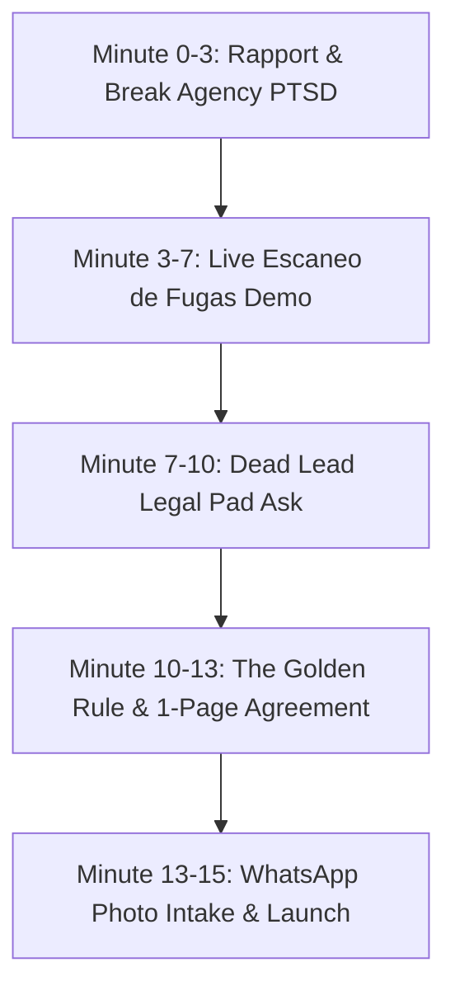

# 72-Hour "Zero-to-Five" Pilot Acquisition Sprint Manual

> **Mission**: Close the first 5 founding Hispanic contractor pilot partners in NYC within 72 hours at a 50% commission discount ($0 upfront, fee triggered only when the deposit clears in QuickBooks Online).

---

## Module 1: Digital Ground War (NYC DOB Permit Radar)

### 1. NYC OpenData DOB NOW / BIS Exact Socrata Query Logic (SoQL)
* **Endpoint**: `https://data.cityofnewyork.us/resource/ipu4-2q9a.json` (NYC DOB Permit Issuance Dataset)
* **Filter Criteria**:
  1. **Boroughs**: Queens (`QUEENS` / Borough Code `4`) & The Bronx (`BRONX` / Borough Code `2`).
  2. **Job Types**: Alteration Type 1 & 2 (A1, A2, Alteration) OR New Building (NB).
  3. **Estimated Job Cost**: $\ge \$30,000.00$.
  4. **Filing Window**: Last 48–72 hours (`filing_date >= current_date - 3`).
  5. **GC Unassigned / Self-Filer Boolean**: `contractor_business_name IS NULL OR contractor_business_name = '' OR general_contractor = 'FALSE'`.
  6. **Occupancy**: Residential (`RESIDENTIAL` / Class `R-2`, `R-3`, `1-2 Family`).

### Raw SoQL Search String:
```sql
$select=job_number,owner_name,owner_phone,job_type,job_description,estimated_cost,borough,house_number,street_name,filing_date,contractor_business_name
$where=(borough='QUEENS' OR borough='BRONX')
  AND estimated_cost >= 30000
  AND (contractor_business_name IS NULL OR contractor_business_name = '')
  AND (job_type='A1' OR job_type='A2' OR job_type='ALTERATION')
  AND filing_date >= '2026-08-16T00:00:00.000'
$order=filing_date DESC
$limit=50
```

### 2. Twilio WhatsApp Data Mapping Architecture
```json
{
  "twilio_whatsapp_payload": {
    "From": "whatsapp:+17185550199",
    "To": "whatsapp:+1{{owner_phone_cleaned}}",
    "Body": "Hola {{owner_name}}, le saluda Nick de Socio en NYC. Vimos su permiso de remodelación registrado en el DOB para {{house_number}} {{street_name}} en {{borough}} (${{estimated_cost}}). ¿Ya tiene contratista general asignado para la obra o le gustaría recibir presupuestos de nuestros 3 mejores maestros locales certificados con seguro COI al día? Cero costo por la consulta.",
    "StatusCallback": "https://socio-one.vercel.app/api/construction/webhooks/twilio-status"
  }
}
```

---

## Module 2: Physical Ground War (Supplier Node Infiltration)

### Strategic Counter Targets:
* **Kamco Supply Corp**: `20-01 43rd Ave, LIC` & `506 Morgan Ave, Brooklyn`
* **Feldman Lumber (US LBM)**: `216 Thames St, Bushwick`
* **Dykes Lumber Co**: `43-50 10th St, LIC`
* **Cancos Tile & Stone**: `32-15 37th Ave, Astoria`

---

### The 60-Second Ruthless Pro-Desk Pitch

#### Spanish Script (Verbatim):
> *"Buenas tardes, jefe. Sé que estás a mil por hora despachando sheetrock y studs, así que voy directo al grano en 60 segundos.*
> 
> *¿Cuántos de tus contratistas regulares vienen aquí y te dicen que tienen que pausar la compra de materiales porque el cliente todavía no les suelta el anticipo o porque no tienen obras cerradas para la próxima semana?*
> 
> *Nosotros somos **Socio**. Les metemos contratos de remodelación en Queens y Brooklyn directamente al WhatsApp de los maestros. **Cero costo fijo, cero cobro por adelantado**. Solo cobramos comisión cuando el cliente deposita el anticipo en su cuenta de banco.*
> 
> *El trato contigo es simple: deja estas 20 tarjetas en tu mostrador. Pon tu nombre y tu Zelle en la parte de atrás. Cada vez que un contratista que tú mandes cierre una obra y cobre el anticipo, **te transferimos el 1% del total del contrato en efectivo a ti directo** ($400 a $1,200 por obra).*
> 
> *Tú vendes más material porque ellos tienen dinero en mano, y tú te llevas una comisión extra cada mes. Mira cómo se ve en mi celular: socio-one.vercel.app/contratistas. ¿Te dejo el primer paquete de tarjetas aquí al lado del POS?"*

#### English Script (Verbatim):
> *"Good afternoon. I know you're slammed moving lumber and drywall orders, so I'll give you the bottom line in 60 seconds.*
> 
> *How many of your steady contractor accounts have to hold off on material orders because they’re waiting on slow client deposits or don't have their next job lined up?*
> 
> *We run **Socio**. We route live NYC residential remodeling contracts straight to contractor WhatsApps with **zero upfront retainers**. We only earn a fee when their customer's initial 20–30% project deposit hits their bank account.*
> 
> *Here is the deal for you: keep this stack of 20 QR cards right by your checkout register. Write your name and phone on the back. When a contractor you hand a card to signs a project through us and clears their deposit, **we send you a direct 1% cash referral kickback** ($400 to $1,200 cash per project).*
> 
> *You move more inventory because they're liquid, and you get paid cash on the side. Take a look on my phone: socio-one.vercel.app/contratistas. Can I set these right next to the receipt printer?"*

---

## Module 3: The "Dead Lead" Closing Protocol (15-Minute Call)

### Script Architecture & Timeline



---

### Step-by-Step Verbatim Call Script

#### Phase 1: Rapport & Eliminating "Agency PTSD" (0:00 - 3:00)
> **Rep**: *"Hola Don [Nombre], le saluda Nick de Socio. Sé que probablemente está en la obra o manejando la camioneta. Primero que todo: **no soy una agencia de marketing digital, no le voy a vender páginas web, y no le voy a cobrar ninguna mensualidad de $1,500 dólares**. ¿Tiene 3 minutos para mostrarle cómo recuperar contratos que ya dio por perdidos?"*
> 
> **Contractor**: *"Ya me han llamado muchos estafadores prometiendo clientes..."*
> 
> **Rep**: *"Exactamente por eso no le pedimos ni un solo centavo. Si usted no cobra dinero en su cuenta de banco, nosotros no cobramos nada. Cero riesgo para usted."*

---

#### Phase 2: The Live Escaneo de Fugas Walkthrough (3:00 - 7:00)
> **Rep**: *"Entre a su celular a **socio-one.vercel.app/contratistas** o déjeme abrir su ficha aquí mismo. Vemos que su empresa [Nombre de Empresa] en [Queens/Bronx] pierde un promedio de 8 llamadas al mes porque usted está ocupado trabajando con la cuadrilla.*
> 
> *En NYC, cuando un cliente con un presupuesto de $45,000 para remodelar un sótano o una cocina llama y nadie contesta en 5 minutos, llama al siguiente contratista en Google. Eso representa más de **$700,000 al año en contratos que se le están escapando**. Socio le pone una asistente por WhatsApp que responde en 90 segundos y le agenda la visita."*

---

#### Phase 3: The "Dead Lead" Legal Pad Ask (7:00 - 10:00)
> **Rep**: *"No quiero que gaste un solo dólar en anuncios nuevos. Hagamos esto: usted debe tener una libreta amarilla o una lista de estimados que dio en los últimos 6 a 12 meses a personas que al final no hicieron la obra o no le volvieron a contestar.*
> 
> *Tómele una foto con su celular y mándemela a este WhatsApp. Nuestra asistente María va a contactar a esos clientes con un mensaje personalizado diciendo que se le abrió un espacio en su cuadrilla la próxima semana. Si cerramos 2 de esos 10 clientes dormidos, usted mete $60,000 en obras nuevas que ya tenía dadas por muertas."*

---

#### Phase 4: The 1-Page Agreement & Deposit-Trigger Rule (10:00 - 13:00)
> **Rep**: *"Nuestro acuerdo cabe en una sola página (socio-one.vercel.app/pilot-agreement):*
> 1. *Cero costo de entrada.*
> 2. *Por ser uno de nuestros 5 contratistas piloto en NYC, tiene un **50% de descuento en la comisión**: solo 4% en obras medianas en lugar del 8% habitual.*
> 3. *Usted solo nos paga cuando el cliente le deposita el 30% del anticipo en su cuenta de banco comercial verificada por QuickBooks.*
> 4. *Si el cliente no le paga o cancela la obra, usted nos debe exactamente **cero dólares**."*

---

#### Phase 5: Closing & Immediate Action (13:00 - 15:00)
> **Rep**: *"Don [Nombre], solo estamos aceptando 5 contratistas para este grupo piloto en Queens y Bronx para no saturar las cuadrillas. Le acabo de mandar el enlace del acuerdo por WhatsApp. Fírmelo con el dedo en la pantalla, mándeme la foto de la libreta, y hoy mismo María empieza a reactivar sus clientes. ¿Listo para empezar?"*

---

## Complete Objection Handling Matrix (Field Armory)

| Contractor Objection | Psychological Barrier | Verbatim Rebuttal Script |
| :--- | :--- | :--- |
| **"Ya pagué $2,000 a una agencia de marketing y no me trajo nada."** | Burned by upfront retainers & fake leads. | *"Entiendo perfectamente su frustración, Don [Nombre]. Las agencias cobran trabajen o no. Con Socio es al revés: si usted no tiene el dinero del anticipo depositado en su banco comercial, nosotros no cobramos un solo centavo. Nosotros absorbemos todo el riesgo."* |
| **"¿Por qué les voy a dar la lista de mis clientes viejos? ¿Se los van a dar a otros?"** | Fear of data theft / client poaching. | *"Sus clientes son 100% suyos bajo contrato de confidencialidad legal en NYC. María se presenta como la secretaria de SU empresa ([Nombre de su Empresa]), no de Socio. Si no cerramos nada, usted no pagó nada y sus clientes siguen siendo suyos."* |
| **"No tengo tiempo para aprender a usar una aplicación o un sistema."** | Technology friction & field fatigue. | *"Usted no tiene que aprender nada. Usted solo usa su WhatsApp de siempre y sigue construyendo en la obra. Nosotros le mandamos el mensaje listo: 'Don [Nombre], tiene visita hoy a las 4pm en Astoria'. Usted solo va, toma medidas y firma."* |
| **"¿Qué pasa si el cliente me paga el depósito pero luego se atrasa en los pagos finales?"** | Cash-flow & milestone risk. | *"Nuestra comisión solo se calcula sobre lo que usted efectivamente haya cobrado y tenga acreditado en su banco. Jamás le cobraremos comisión sobre dinero no cobrado o facturas pendientes."* |
| **"¿Por qué cobran comisión en vez de una tarifa fija?"** | Fear of high fees on big jobs. | *"Porque así nuestros intereses están 100% alineados. Además, tenemos un **Tope Máximo Anual de $40,000**. En cuanto sus obras superen ese tope en comisiones, la comisión cae a **0.0%** y no le cobramos un dólar más en todo el año."* |
