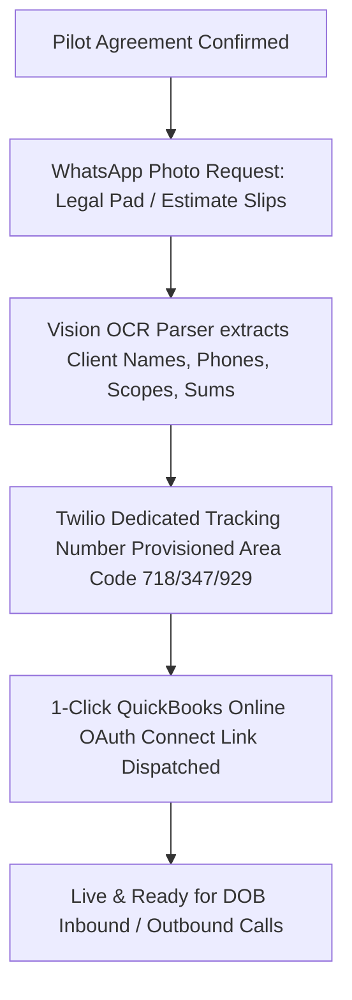

# Socio para Contratistas — Phase 3 GTM Execution Playbook (v1.0)

> **Vertical**: Spanish-speaking General Contractors & Renovation Firms in NYC  
> **Production Platform**: `https://socio-one.vercel.app/contratistas`  
> **Pilot Cohort**: 5 Founding Partners at 50% Commission Discount (6% / 4% / 2.5%)  

---

## 1. Module 1: The "Pitch" Agent (Twilio WhatsApp Cold Outreach)

### 1.1 Outreach Strategy
Hispanic contractors in Queens, Brooklyn, and the Bronx rarely check cold email and reject SaaS landing pages. Outreach is conducted 100% via the **Twilio / Meta WhatsApp Business API**.

### 1.2 Governor Quiet-Hours & Compliance Validation
* **NYC Quiet Hours Gate**: Cold messages are restricted strictly to **07:00 AM – 07:00 PM EST (19:00 EST)**.
* **Touch Cap**: 3 touches maximum per contractor record.
* **Human-in-the-Loop**: Touch 1 requires admin approval before dispatch.
* **Language Mirroring**: Automatically matches inbound reply language (`es` default, switches to `en` if English detected).

```javascript
export function isWithinEstOperatingHours(date = new Date()) {
  const estHour = parseInt(date.toLocaleString('en-US', { timeZone: 'America/New_York', hour12: false, hour: 'numeric' }), 10);
  return estHour >= 7 && estHour < 19; // 07:00 - 19:00 EST
}
```

### 1.3 3-Touch Script Templates (WhatsApp v1.0)

#### Touch 1 (Day 0) — Free 48h Leak Scan & No-Upfront Hook
```text
Hola {{ownerName}}, le saluda Nick de Socio en NYC. Vimos los proyectos que {{companyName}} hace en {{borough}}. Preparamos un *Escaneo de Fugas* de 1 página que muestra llamadas y contratos que están yendo a competidores locales en su zona. Es 100% gratuito y no cobramos nada por adelantado. ¿Le gustaría que se lo comparta por aquí en PDF?
```

#### Touch 2 (Day 3) — Social Proof & Dead Lead Re-opener
```text
{{ownerName}}, quería agregar: con Socio usted *nunca paga por adelantado ni por estimados no cerrados*. Nuestro sistema solo cobra una pequeña comisión cuando su cliente deposita el anticipo en su cuenta bancaria. Si el cliente no paga el depósito, nuestro costo es $0.00.
```

#### Touch 3 (Day 7) — Call Booking & Free DOB Guide Lead Magnet
```text
Don {{ownerName}}, le dejé una nota de voz rápida de 20 segundos arriba. También le adjunto la *Guía de Adquisición de Contratos para Contratistas Hispanos en NYC*. Si en el futuro busca expandir sus cuadrillas, aquí estamos a su orden.
```

---

## 2. Module 2: Automated Onboarding Pipeline (Zero-Friction Intake)

### 2.1 Photo-Based Mobile Intake Workflow
Contractors do not fill out web forms. The entire onboarding process is executed through a guided WhatsApp bot session in **< 7 days**:



### 2.2 Handwritten Estimate OCR Parser
Ingests photo uploads of handwritten pads, extracting phone numbers, contract totals, and deposit figures:
* **API Endpoint**: `POST /api/construction/gtm/onboard/parse-pad`
* **Provisioning Endpoint**: `POST /api/construction/gtm/onboard/provision`

---

## 3. Module 3: "Escaneo de Fugas" Scorecard Generator

### 3.1 3-Pillar Audit & Financial Leakage Model
1. **Google Business Profile Audit**:
   * Unclaimed profile: −30 pts
   * Reviews < 25: −25 pts
   * Photos inactive > 60 days: −15 pts
2. **Contact Response Latency**:
   * Missed call callback > 15 min: −40 pts (78% of NYC owners hire the first responder)
   * Missing after-hours auto-reply (post 5 PM): −25 pts
3. **Follow-up Protocol**:
   * Single-touch estimate delivery: −30 pts

### 3.2 Financial Impact Formula
$$\text{Annual Revenue Leakage} = (\text{Estimated Monthly Lost Bids} \times 0.20 \times 12) \times \text{Avg NYC Project Ticket (\$35,000)}$$

* **API Endpoint**: `POST /api/construction/gtm/leak-scan`
* **Printable Scorecard URL**: `https://socio-one.vercel.app/escaneo-de-fugas-scorecard.html`

---

## 4. Module 4: Pilot Cohort Kill Gate Dashboard

### 4.1 Pilot Cohort Structure
* **Cohort Size**: 5 Founding General Contractors
* **Pricing**: 50% discount on standard commission (6% <$10k, 4% $10k–$50k, 2.5% >$50k)

### 4.2 Strict Kill Gates
* **Gate 1 (Day 45 — Acquisition Gate)**:
  * Metric: Conversion of `Scans Delivered` $\to$ `Pilots Signed`.
  * Threshold: $\ge 30\%$ conversion rate with **5 pilot seats fully signed**.
  * Action on Failure: Triggers `KILL_GATE_FAILED` to reprice the offer or change the acquisition channel.
* **Gate 2 (Day 90 — Economic Provability Gate)**:
  * Metric: Verified bank deposits cleared in QuickBooks Online.
  * Threshold: $\ge 3$ of 5 pilots generate $\ge 1$ contract with a bank-cleared deposit.
  * Action on Failure: Triggers `KILL_GATE_FAILED` if $<3$ pilots generate verified bank revenue.

* **Live Dashboard API**: `GET https://socio-one.vercel.app/api/construction/gtm/pilot-dashboard`

---

## 5. CRM Pipeline Specifications

### 5.1 GoHighLevel Pipeline Schema
* Blueprint: [`workflows/gohighlevel-contractor-pipeline.json`](file:///Users/nick/Desktop/socio/workflows/gohighlevel-contractor-pipeline.json)
* Stages:
  1. `DOB Permit Scanned / Inbound WhatsApp`
  2. `Escaneo de Fugas Generado (PDF)`
  3. `Secuencia WhatsApp Activa (Toque 1-3)`
  4. `Acuerdo Piloto Enviado (50% Desc)`
  5. `Onboarding Activo (<7 Días)`
  6. `Activo / QuickBooks Vinculado (Gate 1 Passed)`
  7. `Primer Depósito Cobrado en Banco (Gate 2 Passed)`
  8. `Descalificado / Kill Gate Failed`

### 5.2 HubSpot Deal Pipeline Schema
* Blueprint: [`workflows/hubspot-contractor-pipeline.json`](file:///Users/nick/Desktop/socio/workflows/hubspot-contractor-pipeline.json)
